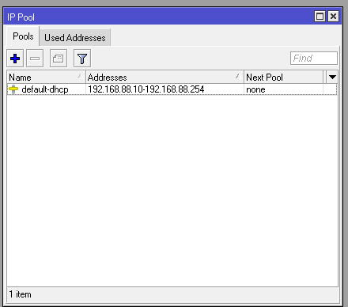
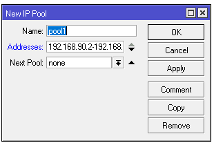
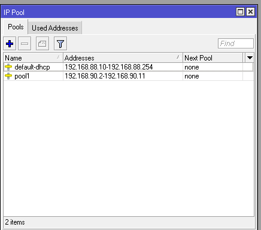
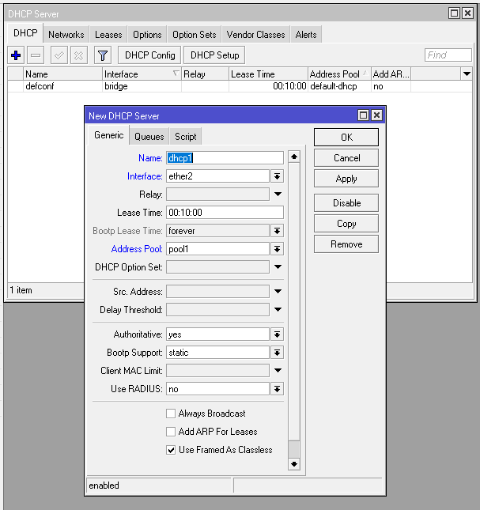
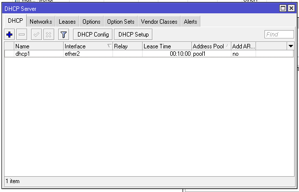
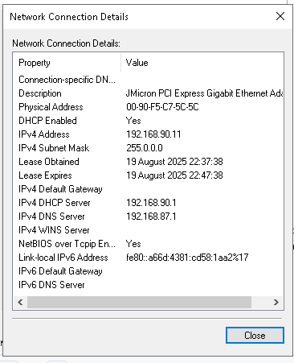

# LAB-30-IP-Pool
tanggal 20 agustus 2025    

# ip pool    
ip pool adalah untuk memberi batasan kepada router mengenai range IP Address yang boleh di berikan untuk client pada suatu jaringan,    
baik untuk client local atau yang lainya. IP yang akan didistribusikan secara otomatis, terutama melalui DHCP server.   

# konfigurasi ip pool   
1. pilih menu IP > POOL

2. klik (+)     
3. di sini saya akan memberikan ip pool pada ether2 di mikrotik saya dimana ip address mikrotik saya yang saat ini di gunakan yaitu : 192.168.90.1/24      
   dan total ip address yang bisa di bagikan ke client berjumlah 254, tapi saya hanya membutuhkan 10 ip address saja untuk client dengan range
   ip address : 192.168.90.2 – 192.168.90.11 (Total 10 Client).
3. buat range ip address yang akan di berikan ke client.

4. Tambahkan IP Pool pada DHCP Server.    
   IP > DHCP server    
   menambahkan ip pool yang telah di buat ke dhcp server pada ether2.    
   

5. Sekarang cek IP di Client, jika belum masuk range ipconfig /renew dulu di cmd.   

6. Sekarang parameter Next pool, next pool ini digunakan jika pool1 sudah penuh, maka pool ip akan ke pool yang dipilih. Contohnya seperti  
   kita membuat pool1 rangenya 192.168.90.2-192.168.90.11 dan pool 2 192.168.90.12-192.168.90.21, jika DHCP server mengunakan pool1 dan pool1 sudah terisi/digunakan semua,
   maka client ke-11 akan mendapat range IP dari pool2.
7. Dan sekarang jika range di pool1 sudah habis, maka client akan diberi IP dari pool2.   

# kesimpulan

IP Pool adalah salah satu fitur dari Mikrotik untuk menentukan range (rentang) IP yang bisa membatasi client   
yang connect wireless dan digunakan untuk DHCP Server maupun Point to Point. Fungsi IP Pool pada Mikrotik  
adalah untuk membatasi range / deretan IP yang akan distribusikan secara otomatis oleh sistem DHCP.

# sumber 

Sumber : www.ahmadsuryadi.net       
netdata : https://nds.id/
